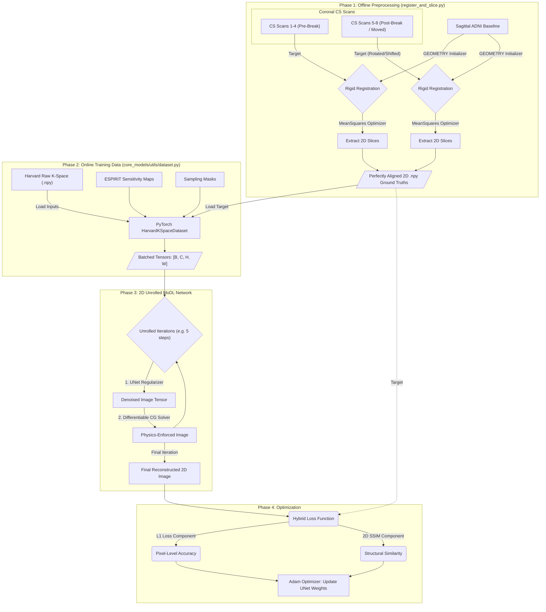

# The CS-MoDL System Pipeline

This diagram illustrates the complete, end-to-end data flow for the Harvard dataset, specifically accounting for patient movement (the Pre/Post Break paradigm) and the 2D Multi-Coil MoDL reconstruction.

### Detailed Breakdown

#### Phase 1: Offline Preprocessing (Handling the Paradigm)
The `register_and_slice.py` script runs **once** offline. Because the patient leaves the scanner during their break, their head orientation completely changes between `CS Scan 4` and `CS Scan 5`. 
To solve this, the script runs the registration algorithm independently for each Block. It uses the `GEOMETRY` initializer to mathematically map the Sagittal ADNI scan to the Coronal CS space. The robust `MeanSquares` optimizer pierces through the noise and locks onto the exact rotation/shift of the patient's head for that specific scan. Finally, it slices the 3D volumes into 2D pieces, saving thousands of `.npy` arrays to the hard drive.

#### Phase 2: The PyTorch DataLoader
The neural network does not waste time doing registration! During training, `core_models/utils/dataset.py` acts as a high-speed engine. It grabs the complex raw `K-Space`, the `Sensitivity Maps`, the `Sampling Mask`, and the pre-aligned `Target` from the hard drive, bundles them into PyTorch Tensors, and fires them into the GPU.

#### Phase 3: The MoDL Architecture
The `UnrolledModel2D` mimics the physics of an MRI machine. 
1. The **UNet Regularizer** looks at the noisy image and removes artifacts.
2. The **Differentiable CG Solver** takes that denoised image, checks it against the raw `K-Space` and `Sensitivity Maps`, and mathematically forces the image to obey the physics of the MRI coils. 
It loops through this process several times (unrolling), refining the image at each step.

#### Phase 4: Hybrid Loss
The final image is compared to the perfectly aligned Target. Instead of just checking if the pixels are the right color (L1 Loss), it also uses **2D SSIM** to evaluate the structural integrity of the brain folds and tissues, ensuring a hyper-realistic reconstruction!
